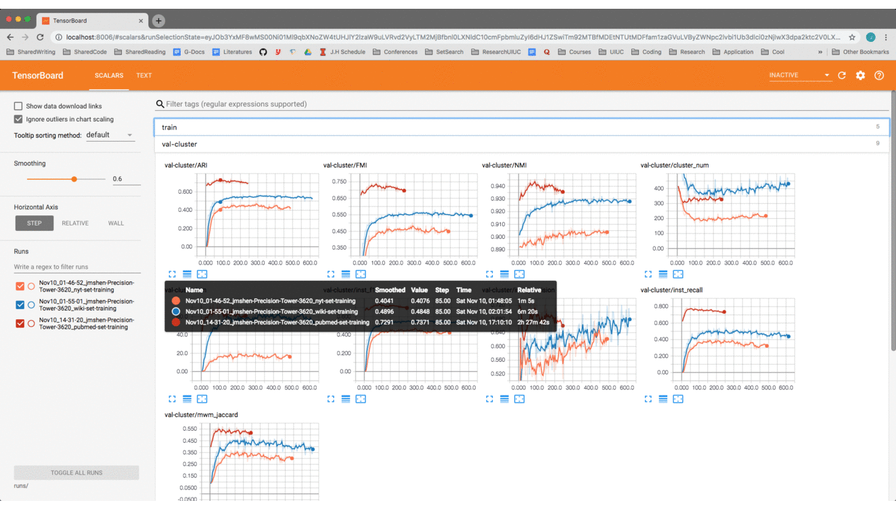

# Mining Entity Synonyms with Efficient Neural Set Generation

[](https://synsetmine.readthedocs.io/en/latest/?badge=latest)

This repo includes datasets, model training scripts, and model evaluation scripts used in paper -- _[Mining Entity Synonyms with Efficient Neural Set Generation](https://arxiv.org/pdf/1811.07032.pdf)_.

Details about SynSetMine model can be accessed [here](https://arxiv.org/pdf/1811.07032.pdf), and this implementation is based on the PyTorch library.

The documents would be available [here](https://synsetmine.readthedocs.io/en/latest/?badge=latest).

## Installation

Simply clone this repository via
```
git clone https://github.com/mickeystroller/SynSetMine-pytorch.git
cd SynSetMine-pytorch
```

Check whether the below dependencies are satisfied. If not, simply install them via
```
pip install -r requirements_full.txt
```

## Training Model

You can train SynSetMine model and test its performance using commands in **run.sh**
```
chmod +x run.sh
./run.sh
```

By default, we will run on NYT dataset. You can uncomment the code in **run.sh** to run on the other two datasets. 

Model snapshots will be saved in **./snapshots/** directory. Logs will be saved in **./runs/** directory, and final results will be stored in **./results/** directory.

## Loading Pre-trained Model for Prediction

We save three pre-trained models, one for each dataset in **./snapshots/** directory. You can load them directly for prediction via:
```
chmod +x predict.sh
./predict.sh
```

## Dependencies

* Python 3 with NumPy
* PyTorch > 0.4.0
* sklearn
* tensorboardX (to display/log information while model running)
* gensim (to load embedding files)
* tqdm (to display information while model running)
* networkx (to calculate one particular evaluation metric)

## Screenshot



## References

If you find this code useful for your research, please cite the following paper in your publication:

```
@inproceedings{Shen2019SynSetMine,
  title={Mining Entity Synonyms with Efficient Neural Set Generation},
  author={Jiaming Shen and Ruiilang Lv and Xiang Ren and Michelle Vanni and Brian Sadler and Jiawei Han},
  booktitle={AAAI},
  year={2019}
}
```

